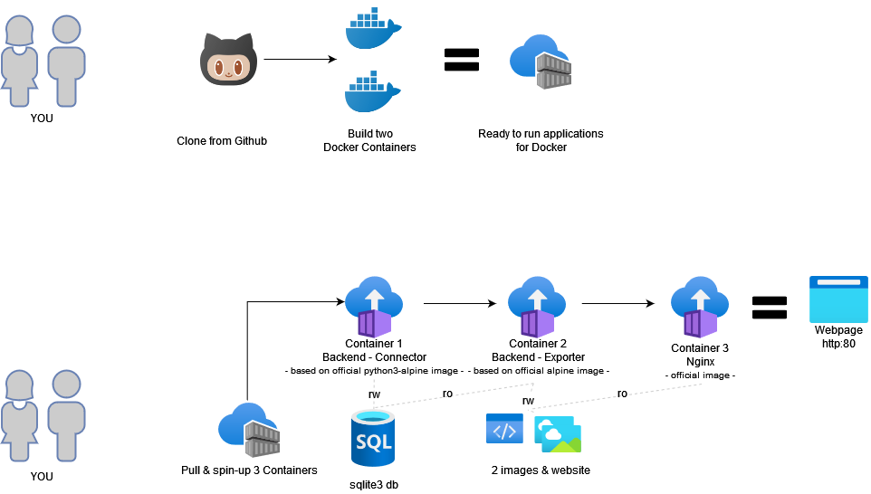

# ProductPriceMonitor.py
Aggregated Product Price Monitor for Graphic Cards

## In a Nutshell
### What you get
Nice graphic with the aggregated price statistics updated 7-8 times a day.

[CLICK HERE for an example page with the service result](http://link-online.de/daily.png)

### How to setup in a picture


## Backend - Connector

### Build
```bash
docker build --no-cache -t ppm-dsc-hpv-gcm.py .
```

### Run
According to baseline:
```bash
docker run --entrypoint <entrypoint.sh> <image:tag> <arg1> <arg2> <arg3>
-v [host directory]:[container directory]
```
Option 1: Interactive with TTY
```bash
docker run -v ~:/usr/src/app/db -it --entrypoint python ppm-dsc-hpv-gcm.py ./PPM-DSC-HeisePV-GCM.py -f ./db/product_price_monitor.db -r 3
```
Option 2: In Background
```bash
docker run -d -v ~:/usr/src/app/db ppm-dsc-hpv-gcm.py
docker exec -it <container name> sh
```

Combine all :D:
```bash
docker run -d -v ~:/usr/src/app/db --entrypoint python ppm-dsc-hpv-gcm.py ./PPM-DSC-HeisePV-GCM.py -f ./db/product_price_monitor.db -r 3
```

## Backend - Exporter

### Build
```bash
docker build --no-cache -t ppm-iv-hpv-gcm.py .
```

### Run
```bash
docker run -d -v ~:/usr/src/app/db -v /srv/nginx:/usr/src/app/img ppm-iv-hpv-gcm.py
```

## Frontend - URL Endpoint

### Run
```bash
docker pull nginx
docker run --name my-nginx -v /srv/nginx:/usr/share/nginx/html:ro -d -p 80:80 nginx
```

The Graphics created by the Backend Components are accessible in your browser with:
```
http://<yourserverip>/daily.png
http://<yourserverip>/intraday.png
```

# Monitoring
```bash
docker logs <container name>
docker inspect <container name>
```

You might be interested that you use "-f" with the logs command to follow the logs continuously.

## Cleaning up
```bash
docker container stop ppm-dsc-hpv-gcm.py
docker container rm ppm-dsc-hpv-gcm.py
docker volume rm <volumename>
```
